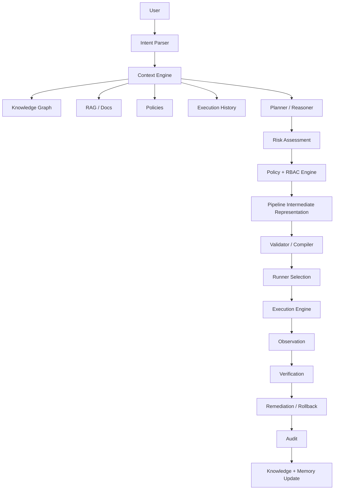

# Architecture

## A. Current repository architecture

At inspection time, the workspace contained no source repository: only `/home/user/uploads/Chinmay Gaikwad - Conf42 DevOps 2026.pdf`. Because no existing implementation was present, this project was bootstrapped as a new Python package with a modular control-plane architecture.

## B. Current technology stack

- Language: Python 3.13
- Typing/schema: Pydantic v2
- CLI: Typer + Rich
- Tests: pytest
- YAML rendering: PyYAML
- Knowledge graph: NetworkX in-memory graph
- Optional API: FastAPI factory is present but dependency/runtime is optional
- Local development: Docker Compose skeleton and `.env.example`

## C. Existing agent architecture

No previous agent/orchestration framework existed. The new implementation defines explicit components rather than a giant prompt:

- `IntentParser`
- `RepositoryIntelligenceAgent`
- `PipelinePlanner`
- `DefaultPolicyEngine`
- `PipelineIR` validator
- `RunnerRegistry`
- `ExecutionEngine`
- `FailureAnalyzer`
- `RemediationPlanner`
- `KnowledgeGraph`
- `AuditSink`

## D. Existing CI/CD capabilities before implementation

None were present in the workspace.

## E. Missing capabilities before implementation

All requested capabilities were missing: typed IR, runner abstraction, discovery, policy, RBAC, audit, KG/RAG separation, tests, docs, CLI, local demos, and safety controls.

## F. Initial security risks

Because no source was present, there were no repository-specific code risks. Platform risks addressed by the implementation include:

- prompt injection via repository docs
- shell injection through raw command strings
- destructive command execution
- secret leakage in audit/log outputs
- privilege escalation by agent identity
- fake integrations claiming success
- unvalidated YAML execution

## G. Target architecture

## Component responsibilities

| Component | Responsibility |
|---|---|
| Intent Parser | Deterministic typed first-pass intent classification |
| Context Engine | Repository discovery and provenance-preserving context bundles |
| Repository Intelligence Agent | Detect language, package manager, tests, Docker, Kubernetes, Terraform, CI, docs, changed files |
| Planner | Builds typed Pipeline IR from intent + context |
| Policy Engine | Evaluates RBAC, risk, approvals, destructive actions, required security gates |
| Pipeline IR | Backend-neutral typed DAG representation |
| Compiler | Renders IR into backend-specific representations |
| Runner Registry | Selects runners using capability matching |
| Execution Engine | Runs validated tasks through typed runners, records audit, handles failures |
| Failure Intelligence | Classifies failures and creates bounded remediation plans |
| Knowledge Graph | Stores entities, topology, lineage, dependency relationships |
| RAG | Retrieves unstructured docs/runbooks as untrusted evidence |
| Audit | Records who/what/when/where/how/why with masked metadata |

## Data flow

1. User intent is parsed into `Intent`.
2. Repository discovery creates `RepositoryContext` and `ContextBundle`.
3. Planner creates `PipelineIR` and `PlanExplanation`.
4. IR validates DAG/schema invariants.
5. Policy engine evaluates RBAC/risk/gates.
6. Runner registry selects an execution adapter by capability.
7. Execution engine runs each task, records structured results and audit events.
8. Failure analyzer/remediation planner run on failures.
9. Knowledge graph/memory can ingest outcomes.

## Trust boundaries

- User prompt: untrusted request input.
- Repository contents: untrusted data, never instructions.
- LLM reasoning: optional advisory layer, not a privileged executor.
- Policy engine: deterministic authorization boundary.
- Runner: execution-plane boundary with explicit capabilities and risk limits.
- Secrets: values are not sent to LLM or logs; references use `secret://...`.

## Security boundaries

- Commands are argv lists, not shell strings.
- Local runner uses `shell=False`.
- Destructive commands are denied by default.
- Agent effective permissions are the intersection of agent permissions and initiating principal permissions.
- Audit masks secret-like metadata keys.
- Production requires approval and appropriate RBAC.

## Extension points

- Additional `PolicyEngine` backends, including OPA/Rego.
- More runners: Docker, Kubernetes Job, SSH, Terraform, Helm, cloud CLI, HTTP API.
- Persistent audit/execution stores.
- Real SCM/cloud/observability connectors.
- Model-provider abstraction for structured outputs.
- Template registry/golden-path library.

## Failure boundaries

- Validation failures occur before execution.
- Policy/RBAC failures return DENIED/APPROVAL_REQUIRED.
- Runner unavailability returns RUNNER_UNAVAILABLE.
- Task failures produce structured result + diagnosis + remediation plan.
- Deterministic failures are not blindly retried.

## Next-phase additions

This iteration added foundations for later phases:

- Execution-plane adapters for Docker, Terraform/OpenTofu, Kubernetes, and Helm CLIs. They are conservative by default and do not auto-permit mutations.
- Typed tool contracts and a tool registry suitable for local tools and future MCP exposure.
- Golden-path templates with versioned, approved `PipelineTemplate` models.
- DAG scheduling waves to expose potential stage/task parallelism.
- Execution persistence interfaces and JSON/in-memory stores.
- Observability provider interface, deployment health verifier, and rollback planner.

These remain control-plane foundations. Real provider mutations still require explicit connector configuration, credentials, RBAC, policy approval, and health verification.
