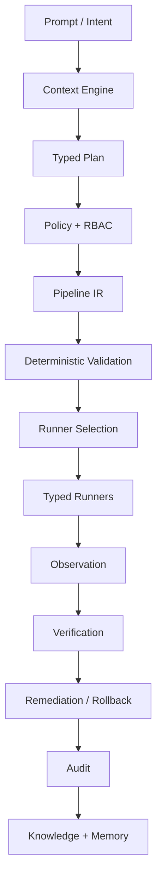

# Agentic CI/CD Control Plane

This repository contains a production-oriented foundation for an agentic CI/CD platform. It is **not** an LLM that writes YAML. It separates:



## What is implemented now

- Typed Pydantic domain models: intent, context, task, Pipeline IR, execution, audit, errors, RBAC identities.
- Repository Intelligence Agent for local repository discovery.
- Deterministic planner producing a normalized Pipeline IR.
- DAG validation: duplicate IDs, missing dependencies, cycles, environment approval references.
- Runner abstraction with capability matching.
- Local shell runner that executes argv commands without `shell=True` and enforces command-risk thresholds.
- Mock runner for test/demo execution without cloud, GitHub, Docker, or Kubernetes credentials.
- Policy engine with baseline RBAC, production approval, destructive action denial, deploy security-gate enforcement, runner/image allowlist hooks.
- Structured audit sink with secret masking.
- Command risk classifier: SAFE, LOW_RISK, MEDIUM_RISK, HIGH_RISK, DESTRUCTIVE.
- Failure analyzer and bounded remediation planner.
- Knowledge graph primitives using relationship entities/edges.
- Local document retrieval separated from graph facts.
- Native JSON, GitHub Actions, and GitLab CI renderers from Pipeline IR.
- CLI for discovery, planning, generation, validation, and local execution.
- Tests covering schema validation, policy/RBAC, prompt injection, runner safety, planning, compilation, execution, failure remediation, and knowledge graph.

## Quick start

```bash
python -m compileall -q agentic_cicd
pytest -q
python -m agentic_cicd.cli discover samples/python_app --json
python -m agentic_cicd.cli plan "Generate a CI pipeline" --repo-path samples/python_app --json
python -m agentic_cicd.cli pipeline validate pipelines/sample_ci_pipeline.json
python -m agentic_cicd.cli pipeline run pipelines/sample_ci_pipeline.json --repo-path samples/python_app --dry-run
```

Run the sample pipeline for real local commands:

```bash
python -m agentic_cicd.cli pipeline run pipelines/sample_ci_pipeline.json --repo-path samples/python_app --execute
```

## Important non-claims

The following are intentionally **NOT IMPLEMENTED** yet:

- Real cloud mutations, GitHub/GitLab API calls, Kubernetes cluster mutations, Terraform apply/destroy execution.
- Persistent database-backed API server unless optional API dependencies are installed and persistence is added.
- Production deployment/rollback adapters.
- OPA runtime execution; an adapter interface exists and returns a structured `NOT_IMPLEMENTED` warning.
- Published GitHub Action packaging for internal tools. Native/local runners can execute internal tools today.

## Repository layout

```text
agentic_cicd/
  api/              Typed API schemas and optional FastAPI factory
  compilers/        IR renderers: native JSON, GitHub Actions, GitLab CI
  core/             Typed domain models, RBAC, errors, audit
  discovery/        Repository intelligence agent
  knowledge/        Knowledge graph, RAG, structured memory
  orchestration/    Planner, execution engine, failure/remediation, state machine
  policies/         Policy engine and OPA adapter placeholder
  runners/          Runner interface, local shell runner, mock runner, registry
  security/         Command risk classification
  tools/            Typed local tools, including secret scanner
tests/              Unit/integration/security-oriented tests
samples/            Sample repositories and fixtures
pipelines/          Generated demo Pipeline IR/YAML
policies/           Example policy documents
failures/           Example failure fixtures
```

## Phase 6-8 additions in this iteration

Added next-phase foundations:

- Docker, Terraform/OpenTofu, Kubernetes, and Helm CLI runner adapters with conservative risk limits.
- Default runner registry no longer auto-registers the mock runner, preventing accidental fake execution.
- Typed tool registry with tool contracts, permission requirements, risk level, schemas, side-effect metadata, timeout, retry, and audit behavior.
- Local typed tools: secret scan, lightweight SBOM generation, and git diff.
- Golden-path template registry with a Python CI template including tests, secret scan, and SBOM.
- DAG scheduler that computes parallelizable execution waves.
- Execution stores: in-memory and JSON file.
- Observability provider interface, mock observability provider, deployment verifier, and rollback planner.
- Additional tests for runner safety, tool authorization, templates, scheduling, observability verification, rollback planning, and execution persistence.

Useful commands:

```bash
python -m agentic_cicd.cli runners --json
python -m agentic_cicd.cli tools --json
python -m agentic_cicd.cli security sbom samples/python_app
python -m agentic_cicd.cli pipeline schedule pipelines/sample_ci_pipeline.json
```

## Phase count and current completion

The master implementation plan has **10 phases**. The current repository now contains foundations for all 10 phases, but not every external provider integration is production-ready.

See `docs/PHASES.md` for detailed phase status.

## Phase 9-10 additions

- Policy-bounded remediation agent with safe bounded retry for transient failures.
- Integration registry and connector contracts.
- Local read-only Git integration.
- Dry-run ticketing and notification connectors.
- Agent inventory with enable/disable, revocation, heartbeat, and kill switch.
- Provider-agnostic LLM abstraction with explicit `NOT_IMPLEMENTED` behavior when unconfigured.

Useful commands:

```bash
python -m agentic_cicd.cli integrations list --json
python -m agentic_cicd.cli runners --json
python -m agentic_cicd.cli tools --json
```

## PR/MR event to deployment mechanism

A provider-neutral PR/MR workflow has been added. It can simulate or process normalized GitHub/GitLab-style PR events through:

trigger → repository discovery → typed DAG pipeline → policy/RBAC → runner execution → package → local deploy simulator → verification → HTML report.

Run a full local merged-PR-to-development flow:

```bash
python -m agentic_cicd.cli events simulate-pr \
  --repo-path samples/python_app \
  --merged \
  --execute \
  --report reports/pr_to_dev_pipeline_report.html
```

See `docs/PR_WORKFLOW.md` for details and production caveats.

## Enterprise Autonomous SDLC Console

A polished standalone dashboard is available. It is an original implementation of an enterprise-style autonomous SDLC console with PR context, agent cards, pipeline DAG waves, governance, security coverage, knowledge graph, and logs.

Run:

```bash
python -m agentic_cicd.cli ui autonomous-demo \
  --repo-path samples/python_app \
  --execute \
  --output reports/autonomous_sdlc_console.html
```

Open:

```text
reports/autonomous_sdlc_console.html
```

It is intentionally not an exact copy of any vendor UI.

## Windows quick start

If you downloaded the workspace on Windows, install dependencies first:

```powershell
Set-ExecutionPolicy -Scope Process -ExecutionPolicy Bypass
.\scripts\windows_setup.ps1
.\scripts\run_autonomous_demo.ps1
```

Do not use Bash-style `\` line continuations in PowerShell. Use a single line or PowerShell backticks. See `docs/RUN_ON_WINDOWS.md`.

## v0.2 GitHub status integration

Version 0.2 adds an optional GitHub commit-status adapter. It can process a GitHub PR webhook payload, run the agentic CI/CD pipeline, and optionally post pending/final commit statuses back to GitHub when `GITHUB_TOKEN` is configured.

Dry-run example:

```powershell
python -m agentic_cicd.cli integrations github-pr `
  --payload samples/webhooks/github_pull_request_merged.json `
  --repo-path samples/python_app `
  --execute-pipeline `
  --status-dry-run `
  --role Maintainer `
  --report reports/github_pr_delivery.html
```

See `docs/GITHUB_STATUS_INTEGRATION.md`.

## v0.3 language-agnostic and runner-agnostic planning

Version 0.3 adds a language provider registry and runner profile catalog. The planner can now generate typed CI tasks for Python, Node.js/TypeScript, Go, and Java/Maven/Gradle repositories.

Examples:

```powershell
python -m agentic_cicd.cli languages --repo-path samples/node_app --json
python -m agentic_cicd.cli runner-profiles --json
python -m agentic_cicd.cli plan "Generate a CI pipeline" --repo-path samples/go_app --json
```

See `docs/LANGUAGE_RUNNER_AGNOSTIC.md`.
