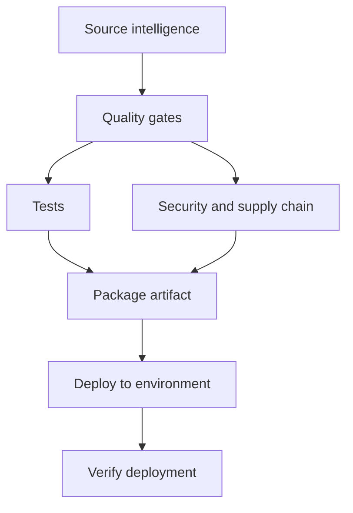

# PR/MR Event to Deployment Workflow

## Does it work for a real PR today?

The repository now contains a working **local/provider-neutral PR-to-deployment pipeline mechanism**:

1. normalize GitHub/GitLab PR/MR payloads into `PullRequestEvent`
2. discover repository context
3. construct a typed DAG pipeline
4. evaluate policy/RBAC
5. select runners
6. execute CI/security/package stages
7. deploy to a safe local simulated environment when the PR is merged or labeled
8. verify deployment state
9. generate a rich HTML report

For a real hosted GitHub/GitLab installation, you still need to configure:

- webhook receiver deployment
- provider signature verification
- repository checkout/mirroring into the runner workspace
- provider credentials for commit statuses/comments/check runs
- real deployment backend if you do not want the local simulator

The code intentionally does not fake those external integrations.

## Local working demo

PR validation only:

```bash
python -m agentic_cicd.cli events simulate-pr \
  --repo-path samples/python_app \
  --action opened \
  --dry-run \
  --report reports/pr_validation_report.html
```

Merged PR to development deployment:

```bash
python -m agentic_cicd.cli events simulate-pr \
  --repo-path samples/python_app \
  --merged \
  --execute \
  --report reports/pr_to_dev_pipeline_report.html
```

Production deployment preparation requiring approval:

```bash
python -m agentic_cicd.cli events simulate-pr \
  --repo-path samples/python_app \
  --merged \
  --label deploy-production \
  --execute \
  --role ReleaseEngineer \
  --report reports/pr_prod_approval_report.html
```

Without `--approved`, production will stop at `APPROVAL_REQUIRED`.

## Pipeline DAG



## Generated local report

The report is pure HTML with inline CSS and can be opened in the workspace viewer:

- `reports/pr_to_dev_pipeline_report.html`

## Optional HTTP webhook endpoint

If optional API dependencies are installed, `create_app()` exposes:

```text
POST /webhooks/pull-request
```

Body:

```json
{
  "provider": "github",
  "payload": {},
  "repository_path": "samples/python_app",
  "principal_id": "webhook-bot",
  "roles": ["Developer"],
  "dry_run": true,
  "approved": false
}
```

Production deployments still require signature verification, auth, persistence, and configured real deployment adapters.
